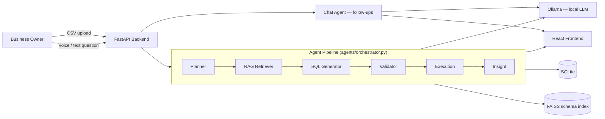

# Voice BI — AI Business Analysis for Owners

A privacy-first tool that helps **business owners** understand their own data. Upload a CSV from your sales, customers, inventory, or finances, then ask questions by **typing or speaking**. A multi-agent AI pipeline analyzes your data locally and returns charts, tables, plain-English insights — and you can keep the conversation going with follow-up questions.

> **No API keys. No cloud. Your data never leaves your machine.**

---

## How It Works

```
1. Upload your business CSV          → data quality check + auto table creation
2. Ask a question (type or voice)    → multi-agent pipeline turns it into SQL
3. Get charts, tables, and an answer → ask follow-ups about the same result
```

### Architecture



Each step in the pipeline is logged with timing and surfaced in the UI as a **pipeline trace** so you can see exactly what the system did to answer a question.

---

## Key Features

- **CSV upload** — tables created automatically, plus an instant **data quality report** (missing values, duplicates, inconsistent types, constant columns) computed directly from the data, no LLM involved
- **Voice input/output** — ask by microphone, hear answers read back (Web Speech API)
- **Conversational follow-ups** — after a result, keep asking ("how can I improve this?") without re-running the full SQL pipeline; the thread persists across questions in a session
- **Data-grounded callouts** — period-over-period change, outliers, and correlation hints computed straight from the result rows, so they're never hallucinated
- **Rich visualization** — bar/line/horizontal/doughnut/cumulative charts, trendline overlay, PNG export, sortable & filterable result table, CSV export
- **Forecasting** — for time-series results, project the next few periods with a least-squares linear trend, drawn as a dashed extension on the line chart (client-side, no LLM, no added latency)
- **Hybrid domain detection** — identifies the business type (restaurant, retail, HR, healthcare, …) from both column names *and* sampled cell values; keyword scoring decides clear cases, and an embedding-based semantic classifier (reusing the RAG sentence-transformer) rescues datasets whose vocabulary isn't in the keyword lists. Near-ties abstain to an honest label rather than guessing.
- **Pipeline trace** — visualizes which agent ran, in what order, and how long each step took
- **Printable report export** — one click to a clean, chart-included PDF via the browser's print dialog
- **Cache & fast mode** — instant repeat queries, optional speed optimizations for slower hardware
- **100% local** — powered by [Ollama](https://ollama.com/), tuned to keep embeddings on CPU so a small GPU (e.g. 4GB) is reserved for the LLM

---

## Setup

### Option A — Docker Compose (recommended)

Requires [Docker](https://www.docker.com/) and a locally running [Ollama](https://ollama.com/) with your model pulled:

```bash
ollama pull qwen2.5-coder:3b
docker compose up --build
```

- App: http://localhost:5173
- API docs: http://localhost:8000/docs

The backend container reaches Ollama on the host via `host.docker.internal` — see [docker-compose.yml](docker-compose.yml) for details. Ollama itself isn't containerized (GPU passthrough into containers is awkward to set up reliably), so install and run it natively.

### Option B — Manual

**Prerequisites:** Python 3.10+, Node.js 18+, [Ollama](https://ollama.com/) installed and running.

```bash
ollama pull qwen2.5-coder:3b
```

```bash
cd backend
python -m venv venv
venv\Scripts\activate        # Windows
pip install -r requirements.txt
uvicorn main:app --reload --port 8000
```

```bash
cd frontend
npm install
npm run dev
```

Open **http://localhost:5173**, upload a CSV, and start asking questions.

---

## API Endpoints

| Method | Endpoint        | Description                              |
|--------|-----------------|-------------------------------------------|
| POST   | `/api/upload`   | Upload a business CSV, get a quality report |
| GET    | `/api/datasets` | List uploaded data + suggestions          |
| POST   | `/api/query`    | Ask a business question (full pipeline)   |
| POST   | `/api/chat`     | Ask a follow-up about an existing result  |
| DELETE | `/api/cache`    | Clear query cache                         |
| GET    | `/api/health`   | Health check                              |
| GET    | `/api/models`   | List installed local Ollama models        |

---

## Project Structure

```
voice_BI/
├── docker-compose.yml
├── backend/
│   ├── Dockerfile
│   ├── agents/           # Multi-agent pipeline: planner, rag_agent, sql_agent,
│   │                      # validator, execution, insight, chat (follow-ups)
│   ├── routes/            # API endpoints (query, upload, chat, datasets)
│   ├── services/           # DB, cache, embeddings, LLM client, data_quality
│   ├── scripts/benchmark.py # SQL-accuracy eval harness (needs Ollama running)
│   ├── tests/              # pytest suite
│   └── data/                # SQLite (created at runtime from uploads)
└── frontend/
    ├── Dockerfile, nginx.conf
    └── src/
        ├── components/  # UI panels (charts, table, chat, pipeline trace, ...)
        ├── hooks/        # Voice input & speech output
        └── utils/        # Client-side result analytics (no LLM calls)
```

---

## Tech Stack

| Layer      | Technology                          |
|------------|--------------------------------------|
| Backend    | Python, FastAPI, SQLite              |
| LLM        | Ollama (local)                       |
| Embeddings | sentence-transformers + FAISS (CPU)  |
| Frontend   | React, Vite, TailwindCSS, Chart.js   |
| Voice      | Web Speech API + Speech Synthesis    |

---

## Testing

Unit/integration tests (fast, no LLM required — agents are mocked where needed):

```bash
cd backend
pip install -r requirements.txt
pytest tests/ -q
```

### SQL accuracy benchmark

Measures whether the pipeline returns the *correct answer* (not exact SQL text match) for a hand-labeled set of questions spanning three datasets (sales, HR, restaurant) and five query categories. Requires a running local Ollama:

```bash
cd backend
python -m scripts.benchmark           # fast mode (heuristic planner)
python -m scripts.benchmark --no-fast # full pipeline (LLM planner)
```

Latest measured result on this machine (`qwen2.5-coder:3b`, fast mode):

```
Overall accuracy: 22/22 (100%)
Avg time per query: 9.0s

Per-category:
  aggregation  8/8  (100%)
  filter       4/4  (100%)
  grouping     6/6  (100%)
  ranking      4/4  (100%)
```

An earlier run scored 21/22: "how many sales are there in total?" generated `SUM(amount)` instead of `COUNT(*)` — a count-vs-sum phrasing ambiguity. This was fixed by adding explicit count/sum/average disambiguation to the SQL-generation prompt, demonstrating how the benchmark drives targeted prompt improvements. The benchmark also reports how many queries were rescued by the SQL self-correction retry loop.

---

## Hardware notes

Tuned for modest local hardware (developed/tested on a GTX 1650, 4GB VRAM):
- Embeddings run on CPU (`EMBEDDING_DEVICE=cpu`) so the LLM keeps the GPU's VRAM.
- Ollama call timeout is configurable (`OLLAMA_TIMEOUT_SECONDS`, default 90s) and fails fast with a clear message instead of hanging.
- `requirements.txt` pins a CPU-only torch wheel to avoid an unnecessary multi-GB CUDA install.

---

## License

Educational and demonstration purposes.
